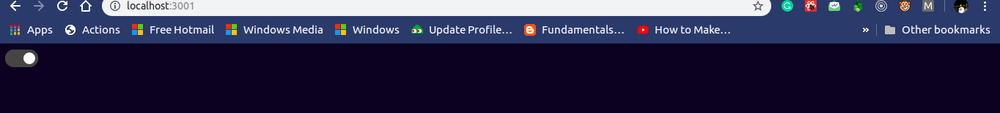

# React Dark

  
[](https://github.com/plxity/React-Dark-Theme)

[](https://github.com/plxity/React-Dark-Theme)


## Important 
### This Module will remember your last theme set and will save it for the future. So when a user starts up an application again it will set the last applied theme automatically. 


## Installation

```

npm install --save react-dark

```

  

## Usage

  Add dark mode feature to your React App in just three simple steps. 

###  Open your main CSS file and follow the steps mentioned.
  
  1) Declare root variables (as per your choice). This will be displayed when dark mode is not enabled.
 ### Note: Use these variables only for specifying values to your CSS properties.
 For example :-
```
:root {
	--bg-color: #fff;
	--heading-color: #000;
}
```
and use it on any class. For example :-
```
.main_heading{
	color: var(--heading-color)
}
```

2) Now decalre the variables which you would like to change when it is changed to dark mode.
```

[data-theme="dark"] {
	--bg-color: #000;
	--heading-color: #fff;
}
```
3. And now your are good to go. Just import the module and use it inside your React Application.


## Working

  

```js

import  Darktheme  from  "react-dark";

```

  

### JS

  

```js

import  React, { Component } from  'react';
import  Darktheme  from  "react-dark";

export  default  class  Example  extends  Component {
	render() {
		return (
			<div>
				<Darktheme  />
			</div>
		)
	}
}
export  default  Example;

```  
### Playground

Find Codepen Implementation of the module [here](https://codepen.io/kuljeet-123/pen/zYGWyoY)

### Development and Testing

1. Set-up the React-Dark module by dowloading its dependencies, using `npm install` command.	
2. Build the module using `npm run build`	
3. Link the module for testing using `npm link` command.	
4. Change your directory to `test-server` directory, using `cd test-server`	
5. Install the dependecies using `npm install`	
6. Now run `npm link react-dark`	
7. Congratulations! You have set-up the test server for react-dark.	
Now just run `npm start` from `test-server` directory to launch the test-server.	
8. You don't need to stop this server, the changes made in the module will be reflected automatically each time you build them using `npm run build`	

Happy Coding :rocket: :rocket:	
