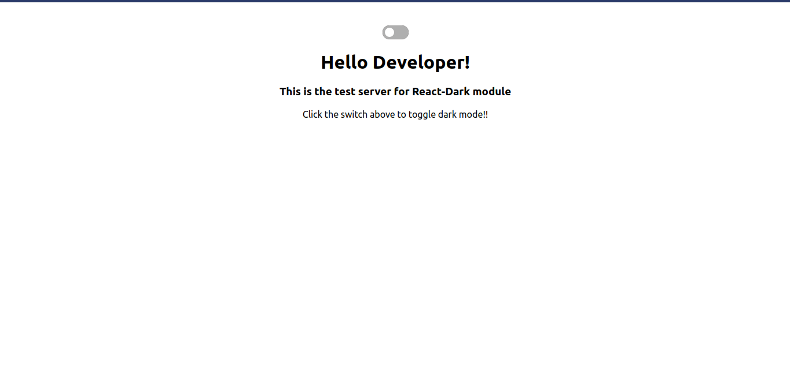
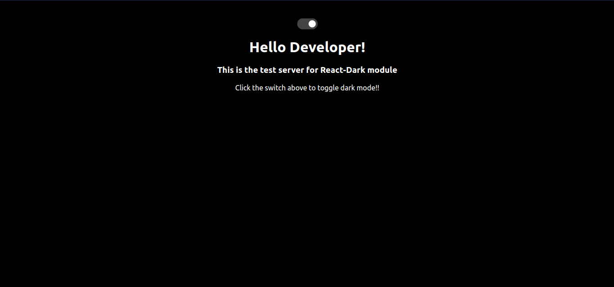

# React Dark

React Dark is a published NPM module that can be integrated inside any ReactJS application. It can be used to integrate dark theme in a few easy steps. It provides you a functionality to customize dark themes as per the need. It also comes with a toggler to switch themes easily. 

<div align="center">
    
    
    
</div>
  

#### Snippet of the working application is displayed below.

* ###### Light Theme
[](https://github.com/plxity/React-Dark-Theme)
* ###### Dark Theme
[](https://github.com/plxity/React-Dark-Theme)


## Important 
### This Module will remember your last theme set and will save it for the future. So when a user starts up an application again it will set the last applied theme automatically. 


## Prerequisites
* NodeJS (check for it's installation on terminal using ```npm -v```)


## Usage

  Add dark mode feature to your React App in just three simple steps. 

###  Open your main CSS file and follow the steps mentioned.
  
  1) Declare root variables (as per your choice). This will be displayed when dark mode is not enabled.

 ### Note: Use these variables only for specifying values to your CSS properties.
 For example :-
```
:root {
	--bg-color: #fff;
	--heading-color: #000;
}
```
and use it on any class. For example :-
```
.main_heading{
	color: var(--heading-color)
}
```

2) Now decalre the variables which you would like to change when it is changed to dark mode.
```

[data-theme="dark"] {
	--bg-color: #000;
	--heading-color: #fff;
}
```
3. And now your are good to go. Just import the module and use it inside your React Application.


## Working
```js
npm install --save react-dark
```
  

```js

import  Darktheme  from  "react-dark";

```

  

### JS

  

```js
import React, { Component } from 'react';
import Darktheme from "react-dark";

export default class Example extends Component {
  render() {
    return (
      <div className="App">
        <Darktheme/>
	//This will set the Background color to dark
      </div>    
      )
  }
}
export default Example;
```

### Playground

Find Codepen Implementation of the module [here](https://codepen.io/kuljeet-123/pen/zYGWyoY)


### Development and Testing

1. Set-up the React-Dark module by dowloading its dependencies, using `npm install` command.	
2. Build the module using `npm run build`	
3. Link the module for testing using `npm link` command.	
4. Change your directory to `test-server` directory, using `cd test-server`	
5. Install the dependecies using `npm install`	
6. Now run `npm link react-dark`	
7. Congratulations! You have set-up the test server for react-dark.	
Now just run `npm start` from `test-server` directory to launch the test-server.	
8. You don't need to stop this server, the changes made in the module will be reflected automatically each time you build them using `npm run build`	

## Contributing
Please read [CONTRIBUTING.md](https://github.com/Awesome-React-Modules/React-Dark/blob/master/CONTRIBUTING.md) for information on how to contribute to React-Pincode.

## Development Guidelines
1. Write clean and readable code with proper formatting.
2. Create a branch and push your code in the branch.
3. Please follow PR template to create PR.
4. Please read our [Code of Conduct](https://github.com/Awesome-React-Modules/React-Dark/blob/master/CODE_OF_CONDUCT.md) .

## Owner
[Apoorv Taneja](https://github.com/plxity) 

Happy Coding :rocket: :rocket:	
